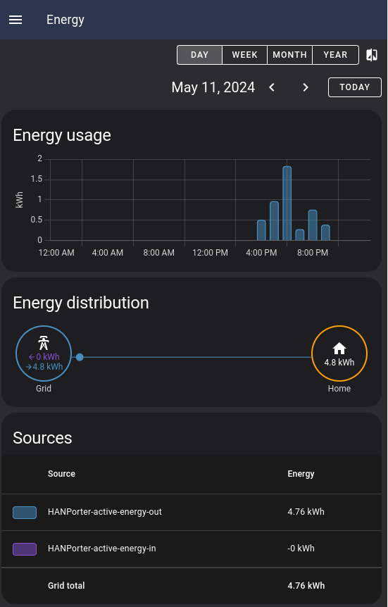
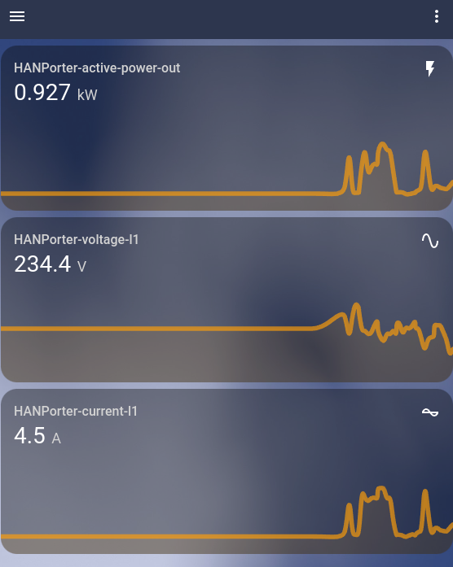

# Energy meter monitoring with Homeassistant integration
This repo lets you read measurements from your energy meter and monitor them using Homeassistant. The repo was created with inspiration from https://github.com/HenrikSolver/picowhanport which is a great source for schematics for the electrical circuit and parts for building your own.

The device automatically registries MQTT Sensors using the discovery feature of Homeassistant.

<div style="text-align:center">
</img></img>
</div>

## Prerequisites

The setup I have been using and that I would say is necessary for replicating the result is:

- An MQTT broker, preferably running on the home network
- An instance of Homeassistant setup with the MQTT Broker
  - Note: the auto-discovery prefix for topics is assumed to be `homeassistant`
- A complete hardware setup as described [here](https://github.com/HenrikSolver/picowhanport?tab=readme-ov-file#h%C3%A5rdvara)
  - This is not to hard if you have access to a soldering iron


## Configuration
The configuration is defined in a single file (except for secrets) for all the different components. It is located at `src/config.py` and can look something like

```python
from energy_meter.han.hancom import Config as HanConfig
from energy_meter.mqtt.communication import Config as ComConfig, Credentials, WlanConfig
from energy_meter.util.log import Config as LogConfig

from secrets import wlan_ssid, wlan_psk, mqtt_user, mqtt_password, mqtt_host

HOSTNAME = "HANMeter"
COM = ComConfig(
    mqtt = ComConfig.MqttConfig(
        host=mqtt_host,
        credentials=Credentials(
            user=mqtt_user,
            password=mqtt_password
        ),
        max_len_queue=32
    ),
    wlan = WlanConfig(
        ssid=wlan_ssid,
        psk=wlan_psk
    ),
    hostname=HOSTNAME
)

HAN = HanConfig(
    id=0,
    timeout=10000, # ms
    pin=17
)
Log = LogConfig(
    log_file="/log.txt",
    in_terminal=True,
    to_file=False, # Buggy, keep as false unless historical logs are really needed
    max_file_size=10000,
    log_level = "WARN"
)
```

More configuration options can be found in the individual submodules.

## Deploying

If you have installed micropython on you device, skip step one.
1. Use the file `RPI_PICO_W-<version>.uf2` (or a newer one) to install micropython on you RPi Zero 2W. To do this, hold the *BOOTSEL* button while plugging it into the host computer. A removable file storage should appear, copy the file here, this triggers a reboot of the RPi and you are done.

2. Connect the RPi Zero W to the USB port of your computer and run the script `deploy.sh`. It copies the necessary files to the device. The next time you boot the RPi, it will try to connect to WiFi and then start publishing messages.

3. If your Homeassistant is already setup with MQTT an integration the new entities should show up. 

## Known issues
- After a soft reset of the device the network connection tends to "hang" and it is not possible to start again. I have tried to disconnect from the WiFi programmatically but without success. I believe the problem comes from not terminating the mqtt connection properly before exiting. A hard reset have always worked.
- Logging to a file is a bit buggy and after a soft reset reading the file can get stuck. Don't use this setting unless really needed.

## Test setup

In order to do development it is important to have a good test bench. Mine is by no means that, but at least served me well and many of the bugs could be found before plugging it into the energy meter. If you want to create you own test setup you can do things differently, I just used whatever I had laying around at home.

Parts:
- A RPi 2b+ to mimic the energy meter
- Inverter circuit to create the same signal as from the energy meter
- Breadboard for the circuit
- Jumper wires for the breadboard

The inverter circuit is a complete rip-off from https://hanporten.se/svenska/kretsschema/ with the only exception that it is mirrored. The energy meter in the picture will be the RPi 2b+ and the other side is connected to the RPi Zero 2W. This is needed to replicate the waveform coming from the energy meter.

Once everything is setup, you simple copy the directory `energy_analog` to the energy meter stand-in and execute `main.py`. This will publish messages every 10 seconds that simulates measurements.

## Future development
- Possible to turn off Homeassistant integration
- Publish messages via bluetooth
